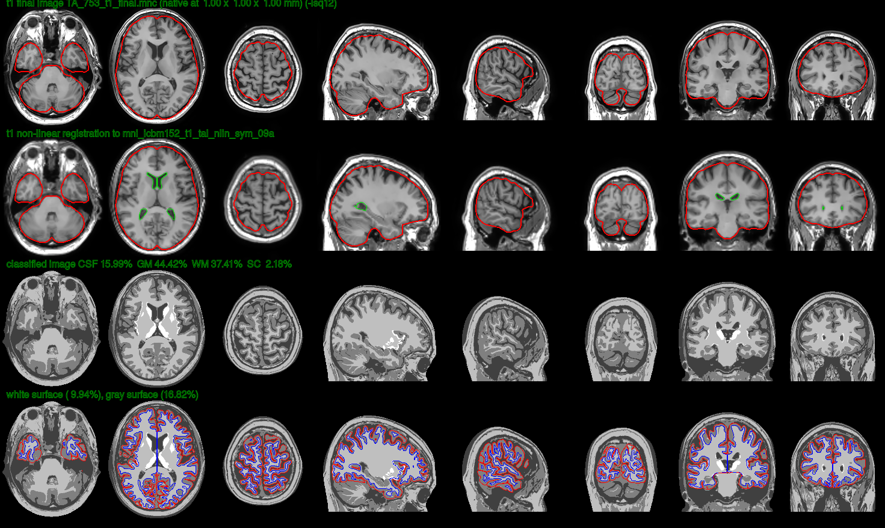
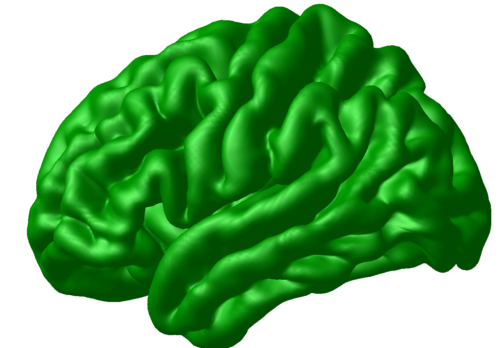
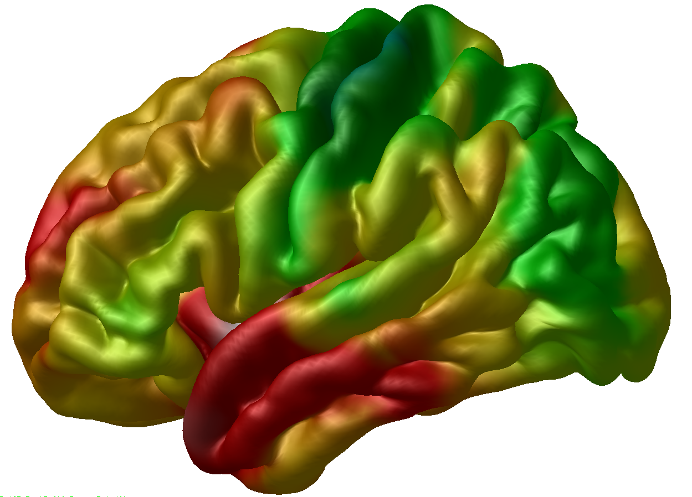
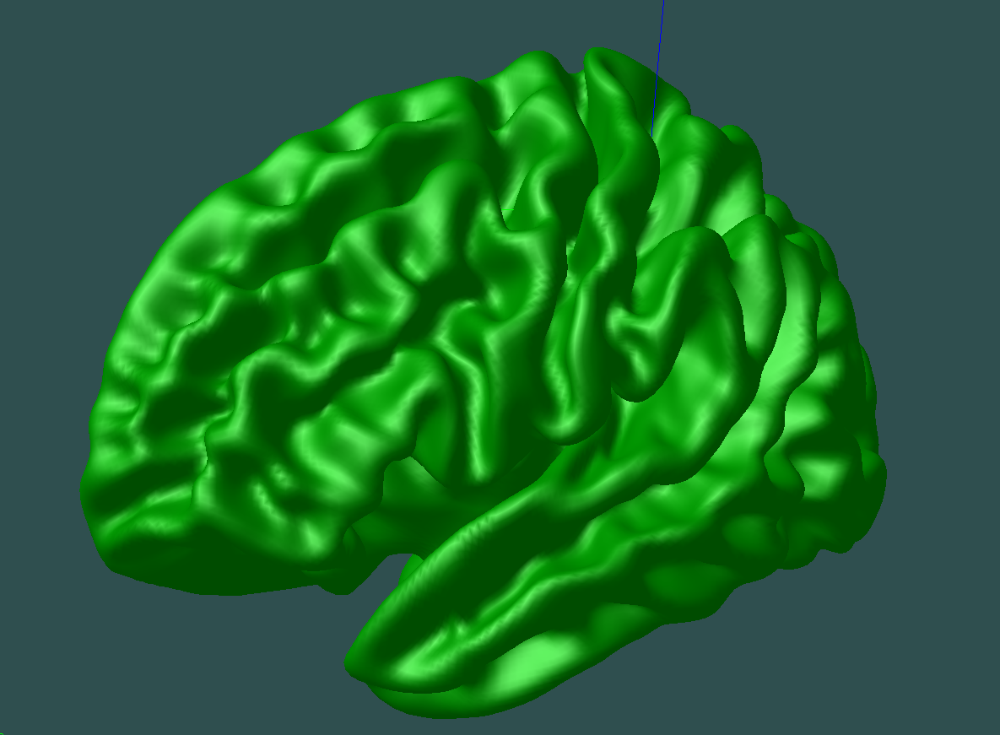
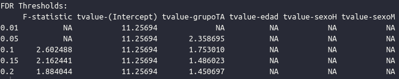
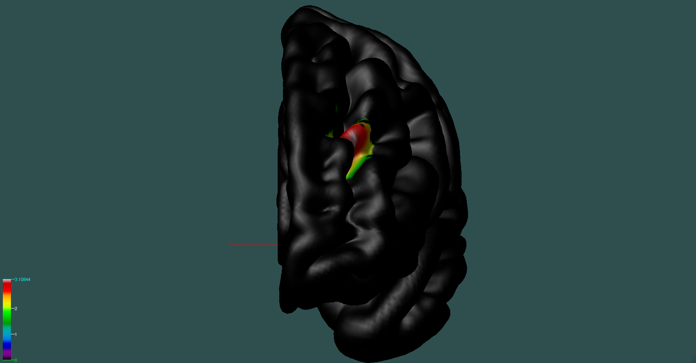
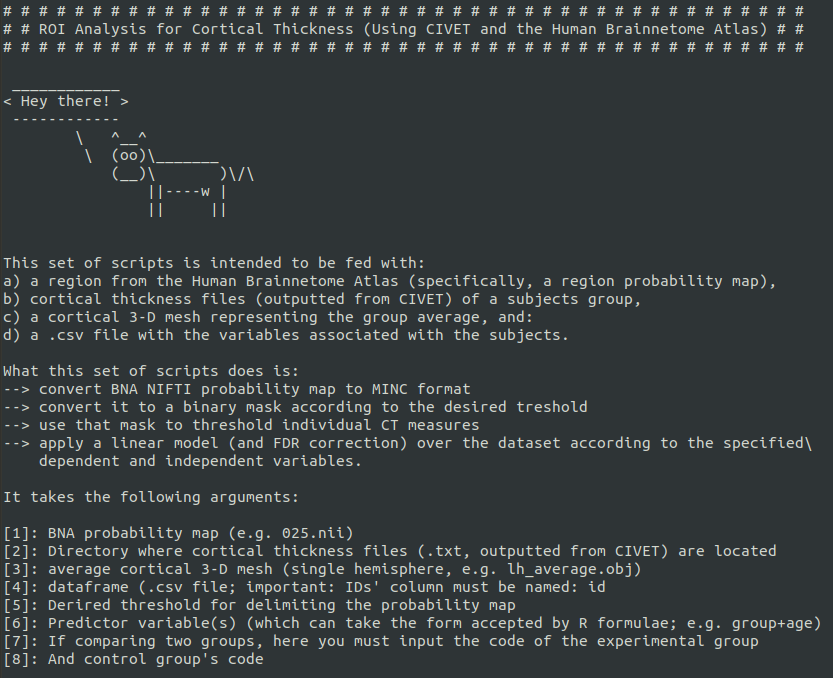
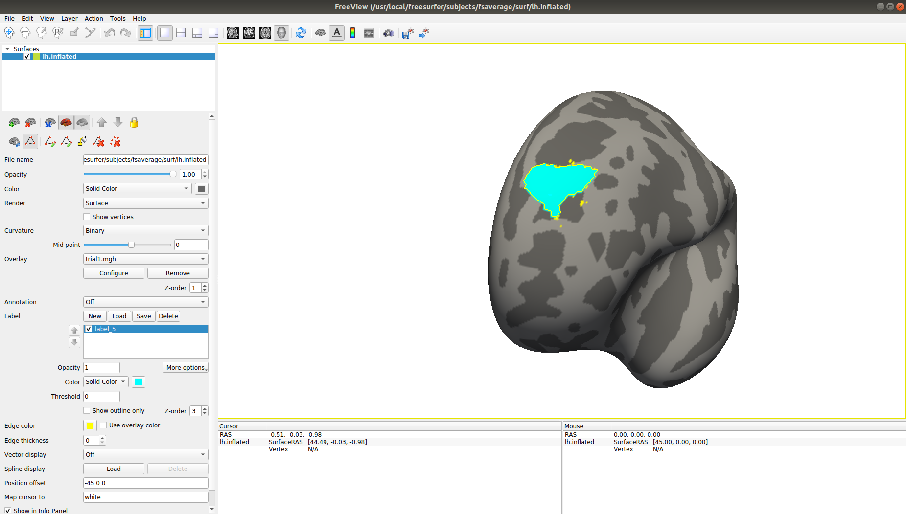

# CORTICAL THICKNESS WORKFLOWS: CIVET AND FREESURFER, WITH A FOCUS ON ROI ANALYSIS

## About this page

In this page I intend to summarise the usage of structural MRI workflows to estimate cortical thickness (CT) from T1-weighted MRI volumes and carry out analyses to answer interesting research questions. My main interest here is to provide a detailed tutorial on CIVET (Montreal Neurological Institute) and RMINC (https://github.com/Mouse-Imaging-Centre/RMINC) to estimate vertex-based individual cortical thickness and later carry out group comparisons and correlations. I will also try to describe -- with lesser detail -- the usage of FreeSurfer (https://surfer.nmr.mgh.harvard.edu/) for CT analyses, especially with an aim towards doing custum region of interest (ROI) analysis.

## Dataset

For the examples we will be using the Empathic Response in Psychotherapists dataset, generated by [Olalde-Mathieu et al. (2020)](https://www.biorxiv.org/content/10.1101/2020.07.01.182998v2) and the structural analysis of which were carried out in [Domínguez-Arriola et al. (2021)](https://www.biorxiv.org/content/10.1101/2021.01.02.425096v2). You can copy the NIFTI volumes as well as the behavioral and demographic information from the directory: /misc/charcot2/dominguezma/tutorial

## CIVET

[CIVET](http://www.bic.mni.mcgill.ca/ServicesSoftware/CIVET-2-1-0-Introduction) is an sMRI processing pipeline developed by The McConnell Brain Imaging Centre to more reliably extract individual cortical surfaces at the vertex-level and estimate cortical thickness in milimeters at each point of the brain cortex. Several definitions of cortical thickness are available to use in the pipeline, and users will be available to choose the one they think is most appropritate. However, there is evidence that the linked-distance definition is more accurate and reliable than other geometric cortical-thickness definitions (Lerch & Evans, 2005). 

### Preprocessing

Users could simply feed the raw volumes to the pipeline; however, I recommend customizing the preprocessing of the volumes to ensure the best quality and most accurate results. This will consist in:

* A qualitative quality control of the volumes.
* [N4 Bias Correction](https://www.ncbi.nlm.nih.gov/pmc/articles/PMC3071855/), and formatting file names.
* Generation of individual brain masks using [volBrain 1.0](https://volbrain.upv.es/).

#### Quality Control 

For this quality control I recommend the one described in [Backhausen et al. (2016)](https://www.ncbi.nlm.nih.gov/pmc/articles/PMC5138230/). Please follow the steps reported in the paper. It basically consists in evaluating each volume in four different criteria, average their score, and decide -- on the basis of the individually asigned score -- whether to preserve or drop the volume for the rest of the workflow. It is important to be rigurous here because the presence of artifacts and overall bad quality can seriously bias the subsequent tissue segmentation and surface extraction.  

#### N4 Bias Field Correction and formatting file names

First, in order to run the *N4BiasFieldCorrection* algorithm ([ANTS](http://stnava.github.io/ANTs/) must be installed) you have to go to the folder where your NIFTI files are, unzip the volumes and, if you wanted to preprocess one file, run for instance: 

```bash
gunzip sub-1000_ses-1_T1w.nii.gz
N4BiasFieldCorrection -i sub-1000_ses-1_T1w.nii -o sub-1000_n4.nii
```
where -i specifies the input and -o the output name. Of course, we would ideally not want to process the volumes one by one, and would like to have the resulting volume in a dedicated directory. We may use a for loop for the former:

```bash
mkdir n4_corrected_output

for nii in *.nii; do
        id=`echo $nii | cut -d "_" -f 1` #extract subject ID
        N4BiasFieldCorrection -d 3 -i $nii -o n4_corrected_output/${id}_n4.nii #Perform correction
done
```

Finally, for the T1 volumes to be ready for the CIVET pipeline, they need to be transformed into MINC files and have a specific pattern in their names; so each file should look something like this: *PREFIX_ID_t1.mnc*, where __PREFIX__ is the study prefix (whichever we want it to be as long as it is consistently used throughout the whole workflow), __ID__ is the indivual volume's identifier, __t1__ tells CIVET that this is a T1-weighted MRI volume that needs processing, and __.mnc__ because it is a MINC file (not NIFTI anymore). For instance, here I would like to use the prefix **TA** and, so, my subject **sub-1000** should look something like this: *TA_1000_t1.mnc*. 

Let's do this in code. Suppose we are in the same directory as before -- i.e where the NIFTI files are, and where we now have a *n4_corrrected_output* folder filled with volumes. For the sake of tidyness I will move all the old NIFTI files to a new directory (since they are no longer useful; but we want them at hand as a backup) and I will create a new directory for the propperly formatted MINC volumes (note that you need to have the [MINC Toolkit](https://bic-mni.github.io/) installed -- or a virtual machine with it): 

```bash
mkdir NIFTI
mv *.nii NIFTI

mkdir mnc_files

for nii in $(ls n4_corrected_output); do
        id=`echo $nii | cut -d "_" -f 1` #extract subject ID
        nii2mnc $nii mnc_files/TA_${id}_t1.mnc
done
```

You can download or copy my script for these two last steps <a id="raw-url" href="https://github.com/elidom/structural-mri/blob/main/N4_formatting.sh" download>HERE</a>. 

#### Generation of brain masks with [volBrain 1.0](https://volbrain.upv.es/)

Even though the CIVET has implemented a brain extraction step (i.e. generation of a binary mask to be multiplied by the original image and strip out the skull, etc.), it might be safer to generate these masks ourselves with a very precise tool: [volBrain 1.0](https://volbrain.upv.es/). First, create a volBrain account (it is free!). Then, upload your NIFTI images one by one (note: they have to be compressed -- i.e. .gz termination) to the volBrain pipeline. Wait until its processing is finished (about 15 minutes; you should receive an email notification). Download the Native Space (NAT) zip file, extract the content, identify the __mask__ file (for instance: _native_mask_n_mmni_fjob293223.nii_)and save it somewhere separate. Be sure to change its name so that you can correctly associate it to its corresponding subject; in the end it will have to be similarly named to the CIVET pattern (PREFIX_ID_mask.mnc), so you might as well save it as, for instance, TA_1000_mask.nii. Before converting the masks into MINC files, carefully inspect that every mask fits the brain as perfectly as possible, so that in future steps only the cephalic mass is segmented from the volume. You can use __fsleyes__ for this, and [manually correct](https://users.fmrib.ox.ac.uk/~paulmc/fsleyes/userdoc/latest/editing_images.html) wherever needed. This quality control of the masks may take time, but it is absolutely necessary; otherwise, the reliability of the rest of the workflow would be compromised.

Finally, the mask files need to be converted into the MINC format. I will suppose that all the mask files are in one dedicated directory and are named like in the example above (e.g. TA_1000_mask.nii). Go to the directory where the masks are stored. You could transform them one by one:

```bash
nii2mnc TA_1000_mask.nii TA_1000_mask.mnc
nii2mnc TA_1001_mask.nii TA_1001_mask.mnc
```
...and so on; but of course, we always prefer to automatize the process:

```bash
for file in $(ls); do
        basename=`echo $file | cut -d "." -f 1`
        nii2mnc $file ${basename}.mnc
done

mkdir nii_masks mnc_masks
mv *.nii nii_masks
mv *.mnc mnc_masks
```
Now all the mask files should be exactly as CIVET asks them to be: PREFIX_ID_mask.mnc (e.g. TA_1001_mask.mnc). You can see the masks I generated in /misc/charcot2/dominguezma/tutorial/masks

### The CIVET pipeline

Now that everything is ready, we can put files together to have CIVET start processing the --now clean-- MRI volumes. To get a broader perspective and fine-grained detail on what CIVET does, please visit their [official website](http://www.bic.mni.mcgill.ca/ServicesSoftware/CIVET-2-1-0-Introduction). In a nutshell, what CIVET does is:

* Registration of idividual volumes to stereotaxic space
* Tissue classification (WM, GM, CSF)
* Surface extraction of left and right hemispheres separately (importantly, this is done through the fitting of a deformable model -- a polygon mesh -- to the individual cortex inner and outer surface. This polygon mesh consists of **40,962 vertices** for each hemisphere; this is important to have in mind, for it is also the number of cortical thickness estimates we are going to be working with in the statistical analysis.).
* Produces regional maps on the base of a couple atlases
* Produces a series of figures and diagrams for quality control
* (Normally, it would start with an N3 intensity normalization and generation of masks for brain extraction; however, in our case these steps will be skipped because we have provided the corrected images and our own brain masks.)

To start with, we are creating a directory specifically for our processing and create a directory therein where all the _T1_ and _mask_ volumes will be.

```bash
mkdir civet
mkdir civet/mnc_vols

mv mnc_files/*.mnc civet/mnc_vols
mv mnc_masks/*.mnc civet/mnc_vols
```
Now it is time to create a script with the specific usage that we would like CIVET to have. To gain a broader perspective visit [this website](http://www.bic.mni.mcgill.ca/ServicesSoftware/CIVET-2-1-0-Basic-Usage-of-CIVET). As specified there, in any CIVET run, we must specify:

- sourcedir *dir* : directory of source images
-targetdir *dir* : output directory
* prefix *name* : the source images prefix (name of study)
* a list of subjects to process (an enumeration or a list in a simple text file)
* an action command (like -run) 

In this case, I will assume that you are working in the C-25 Lab (INB). You have to log into the _charcot_ system, for I know for sure that CIVET is installed in that machine.

```bash
ssh charcot and then input your password
```
Moreover, it has the greatest processing power. We will be using _GNU Parallel_ there to run the pipeline. 

Now I will assume that you are logged into _charcot_, and standing in the recently created _civet_ directory -- which for now only contains the *mnc_vols* directory with all the appropriately named _T1_ and _mask_ files. Now create here a script with the following contents:

```bash
#!/bin/bash

topdir=/misc/charcot2/dominguezma/tutorial/civet

source /misc/charcot/santosg/CIVET/civet_2_1_1/Linux-x86_64/init.sh

ls mnc_vols/*t1.mnc | cut -d "_" -f 3 | cut -d "_" -f 2 | parallel --jobs 6\
/misc/charcot2/santosg/civet-2.1.1-binaries-ubuntu-18/Linux-x86_64/CIVET-2.1.1/CIVET_Processing_Pipeline\
-sourcedir $topdir/mnc_vols\
-targetdir $topdir/target\
-prefix TA\
-N3-distance 0\
-lsq12\
-mean-curvature\
-mask-hippocampus\
-resample-surfaces\
-correct-pve\
-interp sinc\
-template 0.50\
-thickness tlink 10:30\
-area-fwhm 0:40\
-volume-fwhm 0:40\
-VBM\
-surface-atlas AAL\
-granular\
-run {}
```

Of course, you need to change the **topdir** directory accordingly. This script has the following elements:
* First, it starts by feeding the subjects' IDs into GNU parallel (`ls mnc_vols/*t1.mnc | cut -d "_" -f 3 | cut -d "_" -f 2 | parallel`) by calling each T1 volume and cutting their name into their identifier -- e.g. 999.
* Then it tells GNU parallel to run with 6 cores from the machine (`--jobs 6`); charcot has 8 cores, so here I am leaning 2 cores free. You can modify this as you want. 
* With `/misc/charcot2/santosg/civet-2.1.1-binaries-ubuntu-18/Linux-x86_64/CIVET-2.1.1/CIVET_Processing_Pipeline` we are simply calling the pipeline where it is located.
* `-sourcedir $topdir/mnc_vols` specifies where the T1 and mask volumes are located.
* `-targetdir $topdir/target` specifies where we want the output to be; this will create the directory 'target'.
* `-prefix TA` tells civet that we have chosen **TA** as our study prefix (and thus is in every volume's name).
* With `-N3-distance 0`we tell CIVET not to perform any inhomogeneities correction, since we have already done that ourselves.
* With `-thickness tlink 10:30` we tell civet to use the *tlink* geometric definition to estimate individual cortical thickness at each vertex of the cortical surface, and to perform a 10mm and 30mm FWHM diffusion kernel smoothing. For a justification on these parameters please see [Lerch & Evans (2005)](https://www.sciencedirect.com/science/article/pii/S1053811904004185?via%3Dihub).
* Finally, `-run {}` tells CIVET that the subjects we want to run are the ones fed to GNU parallel at the beginning.

For the rest of the parameters please refer to the [CIVET Usage Guide](http://www.bic.mni.mcgill.ca/ServicesSoftware/CIVET-2-1-0-Basic-Usage-of-CIVET). These are the parameters that have proven to work well and that we have used in the laboratory. Feel free to download this script <a id="raw-url" href="https://github.com/elidom/structural-mri/blob/main/run_civet.sh" download>HERE</a>.

First make sure to change the script permits with `chmod a+rwx run_civet.sh`; then, you can simply run the script `./run_civet.sh`. It will take approximately 6 hours per processing round -- i.e. if you specified `--jobs 6` it will take around 6 hours for every 6 subjects. Since we have 35 subjects in the example dataset, it should take around 36 hrs in total.

#### Output quality control

When it is finished processing the volumes we should be able to find a series of fol folders in the *target* directory: *classify, final, logs, mask, native, surfaces, temp, thickness, transforms, VBM, verify*. In the verify directory we should be able to find a set of images that serve to perform quality control, such as this one: 



To interpret the quality control images contained by the verify folder please refer to [this website](http://www.bic.mni.mcgill.ca/ServicesSoftware/CIVET-2-1-0-Quality-Control).

#### Visualizing the output

The *surfaces* folder contains the *.obj* tridimensional brain cortex models of the individual brain. You can see it using Display; for instance, if you are standing within the output folder of a specific subject (i.e. within the _target_ directory), you may type in the console (let us use subject 804 here as an example): 
```bash
Display surfaces/TA_804_gray_surface_left_81920.obj
```

upon which the individual cortical surface model should show up on screen:



To overylay the individual thickness data to this surface, you can click on the surface in the *Objects* window, then go to the *Menu* window and click *File > Load Vertex Data*, navigate to the *thickness* directory, and load the `TA_804_native_rms_rsl_tlink_30mm_left.txt` file -- which is a simple text file with 40,962 vertices (remember that number?) corresponding to the thickness estimates in milimeters for each vertex in the mesh. These are also the files that we are meinly going to be using for the statistical tests. After opening that, the thickness map should show up in the Viewer:



For more information on the usage of Display, please refer to the [MINC Display Guide](http://www.bic.mni.mcgill.ca/software/Display/Display.html)

### Statistical Analysis with R

#### Region of Interest Analysis

Here comes the fun part. For this you will need to have the RMINC package installed in R. If you find it difficult to install the package (which is likely to happen if you are using Ubuntu or Windows, consider using [containers or a virtual machine](https://bic-mni.github.io/#virtual-machine). First of all, I will move all the necessary cortical thickness data (from all the subjects) to one directory accesible from my R project session. So say I have my R project hosted in a directory that is next to the one where my CIVET workflow took place. Then I could move everything I need there. Suppose we are still standing in the CIVET directory.

```bash
mkdir ../rproject/thickness

cp target/*/thickness/*_native_rms_rsl_tlink_30mm_* ../rproject/thickness
```
This code will copy all the 30mm smoothed native cortical thickness resampled *(rsl)* to the MNI ICBM152 surface model to the folder in our rproject, including the files corresponding to the left hemishpere, the right hemisphere, and the asymmetry maps -- if your R project is not exactly next to your CIVET folder, please adapt the code accordingly. For more information regarding the CIVET outputs, [see here](http://www.bic.mni.mcgill.ca/ServicesSoftware/CIVET-2-1-0-Outputs-of-CIVET). 

If your Region of Interest is one of the AAL Atlas regions, please follow [this tutorial](https://github.com/CobraLab/documentation/wiki/ROI-Analysis-in-CIVET) written by Dr. Garza-Villarreal and the CoBrALab. 

Otherwise, you have to get or create your ROI and have in a NIFTI format and have it registered to the MNI-152 standard space. I will give an example here getting a ROI from the [Human Brainnetome Atlas](https://atlas.brainnetome.org/bnatlas.html), which parcelates the brain in more than 240 regions based on structural connectivity. Since ours is a structural analysis, this is appropriate. You can download all the NIFTI probability maps there; to understand what they mean see [Fan et al.](https://pubmed.ncbi.nlm.nih.gov/27230218/). Since these are probability maps you have to choose a threshold to determine the extention of the ROI. The threshold you choose is somewhat arbitrary and depends on your objectives. The important thing is that we choose one *a priori* and stick to it. Here I choose 60, meaning that my ROI will be constituted by the voxels of the MNI-152 model that in at least in 60% of the subjects pertained to the corresponding region --If this did not make sense, see the link above.

Assuming that the probability maps are now stored in a directory (called BNA_PM) next to my CIVET and R-project directories, I could pick and threshold my ROI using FSL (this is one of several methods possible, but the result is the same): 

```bash 
mkdir rproject/roi

fslmaths BNA_PM/015.nii.gz -thr 60 rproject/roi/015_th.nii.gz

cd rproject/roi

nii2mnc 015_th.nii.gz 015_th.mnc
```
As you can see from the code I chose the 015 region, which corresponds to an area of the left dorsolateral prefrontal cortex (dlPFC), and put the thresholded result in a ROI-dedicated directory within the *rproject* domain for practicity. Then we moved there and transformed the NIFTI image to a MINC volume.

Now, before projecting this ROI into the CIVET space, we need an average surface model to display our results on. You could one from your own subjects, or download a standard one [HERE](http://www.bic.mni.mcgill.ca/users/llewis/CIVET_files/CIVET_2.0.tar.gz) -- the files called `CIVET_2.0_icbm_avg_mid_sym_mc_left.obj`and `CIVET_2.0_icbm_avg_mid_sym_mc_right.obj`. Have these files at hand in your workspace. For example, I will move them to a dedicated folder (named avg_objs) in the *rproject* directory, and rename them to lh_average.obj and rh_average.obj respectively. For this tutorial we will only be using `lh_average.obj`, for the BNA_015 region of interest that I am analyzing lies on the left hemisphere. If you visualize one of these CIVET average surfaces with Display (`Display avg_objs/lh_average.obj`) you should see something like this: 



Now we are ready to transform our ROI into the CIVET space using the `volume_object_evaluate` function:

```bash
volume_object_evaluate roi/015.mnc avg_objs/lh_average.obj 015_civet.txt
```
where `015_civet.txt` is the output -- yes, a simple text file with 40,962 pieces of information, each representing one vertex of the cortical model in CIVET space. However, for this to be a valid mask we need it to be constituted by 0's and 1's defining where in the CIVET space the ROI is. This is simple to achieve: we just need to replace all the numbers that are greater than 0 by 1. This could be done using *regular expression*, but since I am pretty much unfamiliar with it, I do it using R. So you can initialize R simply by typing `R` in the shell, and then do:

```R
thick <- read.csv("015_civet.csv", header = FALSE)

isgtzero <- thick > 0

thick2 <- ifelse(isgtzero == TRUE, 1, 0)

write.table(thick2, "015_civet_bin.csv", col.names = FALSE, row.names = FALSE)
```
Then, you can quit R typing `q()`, and a file called "015_civet_bin.csv" (*bin* meaning binarized) should be now available in the current directory. This is our mask in CIVET space.

Now we should use `vertstats_math` to multiply our thickness files by the recently created mask. Remeber, this will all now happen in CIVET space; that is through .txt files containing 40,962 rows of data, each representing one vertex. We should do this with a `for` loop:

```bash
for file in thickness/*_native_rms_rsl_tlink_30mm_left.txt; do
        vertstats_math -mult 015_civet_bin.csv $file -old_style_file $(dirname $file)/$(basename $file .txt)_roi.txt; 
done
```
Now in our `thickness` folder there are individual files containing the cortical thickness data of the ROI for every subject. For example, we now have a file named `TA_804_native_rms_rsl_tlink_30mm_left_roi.txt`, and so one. If you have more than one ROI and you go through this proess several times, remember to use an identifier for each ROI; for instance naming them `[...]_roi015.txt` and so forth. We will use these files in R using the RMINC package. 

We will also be needing now the CSV file containing all the behavioral and demographical information. This CSV file has one row per subject and one column per variable (ID, Group, Age, Sex, Psychometric Score 1, Score 2, Score 3, etc).

So now let's open R (preferably using RStudio). Once in R (or RStudio), let's load the RMINC and dplyr packages (make sure to have them installed first, of course). And run the following code, which should:
* read the CSV file
* tidy the data where needed (e.g. making a discrete variable a factor)
* attach a new column to the data frame containing the location of each individual's ROI cortical thickness information.
* Relevel groups (i.e. define which is your control group)
* Load the mask in CIVET space
* Fit the desired vertex-wise linear model (in this case `thickness ~ group + age + sex` in first instance).
* Perform an FDR correction for multiple comparisons (this is where we get an answer to our question 'is there a statistically significant difference between the study groups in the selected ROI, taking age and sex as confounding variables?')
* Write the resulting statistics into a new statistical map (again a 40,962 TXT file) that we will be able to visualize afterwards.

```R
# Load libraries
library(RMINC)
library(dplyr)

# Load CSV file
info_subs <- read.csv("info_subs.csv")

# Peek into data 
head(info_sujetos)

# Tidy 
info_subs <- info_subs %>%
  mutate(sex = factor(sex),
         group = factor(group))
         
 
# Add thickness data
info_subs$roi015_thickness <- paste("thickness/TA_", info_subs$id, "_native_rms_rsl_tlink_30mm_left_roi.txt", sep = "")

# Check that there is now a new column named 'roi015_thickness'
names(info_sujetos)
info_sujetos$roi015_thickness # I recommend copying one of the results here and pasting it in the console after the 'ls' command to see if the information is correct

# relevel groups
info_subs$grupo <- relevel(info_subs$group, ref = "NT")  #Control group is called NT (Non-Therapists) in the dataframe

# load CIVET mask
bna015_mask <- read.table("015_civet_bin.txt")

# Fit linear model
vs <- vertexLm(roi015_thickness ~ group + age + sex, info_subs)

# Perform FDR correction for multiple comparisons (Is there a signifficant effect? see below)
vertexFDR(vs, mask = bna015_mask) 

write.table(x=vs[,"tvalue-groupTA"], col.names = FALSE, row.names = FALSE, file = "statistical_map_roi015_civet.txt")
```
Feel free to download this script <a id="raw-url" href="https://github.com/elidom/Cortical-Thickness/blob/main/civet_roi_analysis.R" download>HERE</a>. .

Now a file called `statistical_map_roi015_civet.txt`should be vailable in the workspace. When you run the `vertexFDR` command you should check in the output whether there is an effect (a t-value) in this case below an FDR threshold of interest (normally 0.05). In this example we do get an effect of group, as seen in the result:



If we wanted to visualize the statistical map on a 3D surface we first have to modify the CIVET statistical map file; just type on the shell `sed -i 's/NA/0/g' statistical_map_roi015_civet.txt`, which will change all the NAs into 0s. Then we can type in the console `Display avg_objs/lh_average.obj`; after Display is open go to the Object Window, click on the green surface label, then go to the Menu Window, and click on File >> Load Vertex Data >> Then load the `statistical_map_roi015_civet.txt` file. Our statistical map is then displayed on screen:



where the vertex-wise t-values are displayed on a color gradient, just within the ROI (the rest is 0).

##### Automatization

I have automatized all this process here: https://github.com/elidom/CorticalThickness_ROI_Analysis_CIVET_BNA or [HERE](https://github.com/elidom/Cortical-Thickness/tree/main/roi_automatized)
You just have to download the scripts, put them in the directory where your files are, and call the `make_me_a_ROI.sh`script with its required arguments. If you do not feed it with any arguments, you will get the help message with the necessary information.



For instance, you could type:

```bash
./make_me_a_roi.sh 015.nii thickness avg_objs/lh_average.obj info_subs.csv 60 group+age+sex TA NT
```
Or, if we have several ROIs, then:

```bash
for roi in $(ls); do
        ./make_me_a_roi.sh $roi thickness avg_objs/lh_average.obj info_subs.csv 60 group+age+sex TA NT
done
```
Each individual result will be displayed on the console and the resulting statistical map will be made available in the working directory. 

If we want information on the effect of other variables--for instance, correlation with behavioral scores--we can do:

```bash
for roi in $(ls); do
        ./make_me_a_roi.sh $roi thickness avg_objs/lh_average.obj info_subs.csv 60 psychometric_score+age+sex TA NT
done
```

### Whole-Hemisphere Analysis

After completing our ROI analysis, we might mant to explore the effect size values of the model over the whole brain, or we could have a hypothesis concercing global cortical thickness. Let's now explore those possibilities. The process is very similar, with the difference that we obviously do not have to create any mask. So, it is much easier.

The conditions to do this are already there; namely, that the individual whole-brain thickness data are in our thickness folder, within the R project directory (that is where we extracted the ROI information from).

So let's open R (or Rstudio) and do the following (very similar to the ROI workflow, except the CSV files contain whole-brain data and we do not load any ROI mask:
* read the CSV file
* tidy the data where needed (e.g. making a discrete variable a factor)
* attach a new column to the data frame containing whole-brain cortical thickness information.
* Relevel groups (i.e. define which is your control group)
* Fit the desired vertex-wise linear model (in this case `thickness ~ group + age + sex`).
* Calculate the Effect Size statistical map (Hedges' g) from the model above.
* Write the resulting statistical map into a TXT file in our working directory
* Perform an FDR correction for multiple comparisons and test a whole-hemisphere hypothesis (this is where we get an answer to our question 'is there a statistically significant difference between the study groups in the selected ROI, taking age and sex as confounding variables?')
* Write the resulting statistics into a new statistical map (again a 40,962 TXT file) that we will be able to visualize afterwards.

```R
# Load libraries
library(RMINC)
library(dplyr)

# Load CSV file
info_subs <- read.csv("info_subs.csv")

# Peek into data 
head(info_sujetos)

# Tidy 
info_subs <- info_subs %>%
  mutate(sex = factor(sex),
         group = factor(group))
         
 
# Add thickness data
info_subs$left_thickness <- paste("thickness/TA_", info_subs$id, "_native_rms_rsl_tlink_30mm_left.txt", sep = "")

# Check that there is now a new column named 'left_thickness'
names(info_sujetos)
info_sujetos$left_thickness # I recommend copying one of the results here and pasting it in the console after the 'ls' command to see if the information is correct

# relevel groups
info_subs$grupo <- relevel(info_subs$group, ref = "NT")  #Control group is called NT (Non-Therapists) in the dataframe

# Fit linear model
vs <- vertexLm(left_thickness ~ group + age + sex, info_subs)

# Create Effect Size Statistical Map (Hedges'g)
effectsize <- vertexEffectSize(vs)
head(effectsize) # take a glimpse

# Write TXT effect size map
write.table(x = effectsize[,"hedgesg-groupTA"], file = "effsize_statmap.txt", col.names = FALSE, row.names = FALSE)

# Perform FDR correction for multiple comparisons (test whole-hemisphere hypothesis) This should output whether there are any statistically significant differences between the groups taking age and sex as cofounding variables.
vertexFDR(vs) 

# Write TXT t-value statistical map
write.table(x=vs[,"tvalue-groupTA"], col.names = FALSE, row.names = FALSE, file = "statistical_map_lefth.txt")
```

And done. The statistical should now be available in our working directory for visualization through the same means as above. The script is <a id="raw-url" href="https://github.com/elidom/Cortical-Thickness/blob/main/civet_wholehem_analysis.R" download>HERE</a>.

The same procedures apply to the right hemisphere (just using the right hemisphere model for parcelation and visualization) and the asymmetry estimates (which measures how much thicker--or thinner--cortical thickness in the left hemisphere is with respect to the right hemisphere; this could also yield interesting inter-group differences.

## FreeSurfer 

[FreeSurfer](https://surfer.nmr.mgh.harvard.edu/) is a different, more popular pipeline. Its main aim is the same, namely, to extract individual brain cortical surfaces and estimate the distance between the inner and outer surface of the brain cortex. However, CIVET and FreeSurfer differ in several aspects; for instance, in their volumes registration algorithm, deformable model expansion algorithm, and their geometric deffinition of distance when estimating cortical thickness. A well-known consequence of this is that there is variation between the results obtained by each workflow (e.g. [Bhagwat et al. 2021](https://academic.oup.com/gigascience/article/10/1/giaa155/6106556)). Nevertheless, it is expected that both pipelines are able to detect the same general patterns of cortical thickness or, in the case of group studies, similar patterns of between-group differences ([Kharabian Masouleh et al.2020](https://scholarworks.utrgv.edu/som_pub/189/)). [Bhagwat et al. 2021](https://academic.oup.com/gigascience/article/10/1/giaa155/6106556) recommend using more than one tool in a study and report the differences in the results.

FreeSurfer has the feature of performing a vertex-wise, whole-brain analysis, correct for multiple comparisons ([Hagler et al. 2006](https://pubmed.ncbi.nlm.nih.gov/17011792/)) and, thus, identify significant clusters. If this is all one is looking for, the standard procedure is quite straightforward and very good tutorials have been made in the past (e.g. this [FreeSurfer Short Course in *Andy's Brain Book*](https://andysbrainbook.readthedocs.io/en/latest/FreeSurfer/FreeSurfer_Introduction.html)). Here we will perform first a ROI analysis using our own prefedined ROI. Moreover, instead of letting FreeSurfer run all the processing by itself, we will run its first part, feed it with our own volBrain 1.0 generated, manually corrected skull-stripping masks, and then run the rest of the pipeline--presumably more accurately than if we did not use our better masks.

Here, again, we ought to have all our NIFTI volumes in one same folder. So I will assume that all the *.nii.gz* volumes that need processing are in a directory called *FS* somewhere in your machine. First, we may want to create a plain text file with all our subject ID's for future processing steps:

```bash
ls *.nii* | cut -d "_" -f 1 | cut -d "-" -f 2 > subjList.txt
```
We verfy that we get a plain text file with one subject ID (only the number!) per row: `cat subjList.txt`.

Then, we need to denoise and correct the signal intensity inhomogeneities in the individual volumes, in the same way as we did with CIVET.

```bash
cd FS

for nii in *.nii.gz; do
        id=`echo $nii | cut -d "_" -f 1` #extract subject ID
        N4BiasFieldCorrection -d 3 -i $nii -o ${id}.nii.gz #Perform correction
done

#Move original NIFTIS somewhere else
mkdir NIFTI_original
mv *T1w* NIFTI_original 

# Unzip our NIFTI volumes: 
gunzip *.gz
```
Now we have to specify that what the folder where we want output to be placed is. I will create a new directory called rcnall1 for this. For example, I would type:

```bash
mkdir rcnall1
SUBJECTS_DIR=/misc/charcot2/dominguezma/tutorial/FS/rcnall1
```
Now we are ready to initialize the first part of the FreeSurfer pipeline. Again, using parallel, with the following command:

```bash
ls *.nii | parallel --jobs 6 recon-all -s {.} -i {} -autorecon1
```
Here I specify that 6 jobs should be run simultaneously (this depends on how many cores you want to use; since I am working in charcot, 6 is a perfectly reasonable number. `-s {.}` means that the subjects' names are in the list given at the beginning (`ls *.nii*`) up to the `.` (hence the `{.}`). `-i {}` means simply that the input files are all those named with the `ls *.nii*` at the beginning of the command.

While this runs, we might want to move our masks to the FS directory.

```bash
mv ../edited_masks .
```
After the first reconstruction (*autorecon1*) step is complete, we want to substitute the default skull-stripping masks (i.e. those created by FreeSurfer) by the ones we created with VolBrain and manually corrected. First let's move the N4-corrected imaged to their own folder - for tidyness - with:

```bash
mkdir N4

mv *.nii N4
```

The mask substitution is to be done with the following script:

```bash
#!/bin/bash
# GO to dir
topdir=$1

cd $topdir
echo "# # # # #working directory is `pwd `"

N4Folder=N4
reconallFolder=rcnall1
maskdir=edited_masks

SUBJECTS_DIR=$reconallFolder


for nii in $(ls $N4Folder); 
do
	### crear ID de sujetos
	id=`echo $nii | cut -d "_" -f 1`
	echo "$id created"


	### Part 1: Get transformation matrix to FS space
	## mgz --> nii

	mri_convert $reconallFolder/$id/mri/T1.mgz $reconallFolder/$id/mri/T1.nii.gz

	
	mri_convert $reconallFolder/$id/mri/brainmask.mgz $reconallFolder/$id/mri/brainmask.nii.gz


	##  Compute matrix
	flirt -in $N4Folder/$nii -ref $reconallFolder/$id/mri/T1.nii.gz -out $reconallFolder/$id/mri/T1_to_FS.nii.gz -omat $reconallFolder/$id/mri/T1_to_FS.mat

	
	### Part 2: Use matrix to transform to FS space
	## Volbrain mask --> FS space

	VolBrain_mask=$maskdir/${id}_mask.nii

	flirt -in $VolBrain_mask -ref $reconallFolder/$id/mri/T1_to_FS.nii.gz -applyxfm -init $reconallFolder/$id/mri/T1_to_FS.mat -out $reconallFolder/$id/mri/mask_vol_brain_FS.nii

	##  Multiplication
	
	fslmaths $reconallFolder/$id/mri/T1.nii.gz -mul $reconallFolder/$id/mri/mask_vol_brain_FS.nii $reconallFolder/$id/mri/brainmask_new.nii.gz
	

	## nii --> mgz
	
	mri_convert $reconallFolder/$id/mri/brainmask_new.nii.gz $reconallFolder/$id/mri/brainmask_new.mgz

	## Add metadata
	
	mri_add_xform_to_header $reconallFolder/$id/mri/transforms/talairach.auto.xfm $reconallFolder/$id/mri/brainmask_new.mgz

	### Step 3: Tidy
	## Rename originals
	
	mv $reconallFolder/$id/mri/brainmask.mgz $reconallFolder/$id/mri/brainmask.original.mgz 

	
	mv $reconallFolder/$id/mri/brainmask.auto.mgz $reconallFolder/$id/mri/brainmask.auto.original.mgz 

	
	## place new files
	mv $reconallFolder/$id/mri/brainmask_new.mgz $reconallFolder/$id/mri/brainmask.mgz

	
	cp $reconallFolder/$id/mri/brainmask.mgz $reconallFolder/$id/mri/brainmask.auto.mgz 

done
```

The script can be downloaded <a id="raw-url" href="https://github.com/elidom/Cortical-Thickness/blob/main/reconall_1.sh" download>HERE</a>

Finally, we complete the reconstruction process with the following command:

```R
ls N4/*.nii | parallel --jobs 6 recon-all -s {.} -i {} -autorecon2 -autorecon3 -qcache
```
The logic in the call to parallel is the same as with the first reconstruction command (*autorecon1*).

### Creating a ROI

While we wait for the previous process to finish (it might take from hours to days, depending on the amount of subjects you have) we can create the ROI of interest. This must be done partially by hand. I assume that we want to use approximately the same ROI as with CIVET. So we should have the thresholded NIFTI image at hand. I will assume that it is in a folder (within the FS directory) called `roi`. So, first, we register the NIFTI ROI into the `fsaverage`surface space:

```bash
mri_vol2surf --src roi/015_th.nii.gz --out roi/015.mgh --mni152reg --hemi lh --trgsubject fsaverage

```
Here we specified:
* `--src roi/015_th.nii.gz`: where our NIFTI ROI file is.
* `--out roi/015.mgh`: where we want the output to be.
* `--mni152reg`: that our ROI is currently in the MNI 152 stereotaxic space
* `--hemi lh` that it corresponds to the left hemisphere
* `--trgsubject fsaverage` that we want the output to correspond to the fsaverage space.

Then we open the fsaverage surface and overlay the newly created ROI surface file:

```bash
freeview -f $SUBJECTS_DIR/fsaverage/surf/lh.inflated:OVERLAY=roi/015.mgh

```
Then use the 'Path/Custom Fill' tool on the control panel to start drawing the outline of the overlayed ROI. Then click on 'Make Closed Path', then 'Custom Fill', click on wichever point within your outline, mark the option 'Up to and including paths', click on 'Fill' and then close the window. You can now change the fill color and it should look something like this:



Then click on 'Save' in the panel and save the `.label` file in our recently created `roi` directory. Say, as `roi015.label`.

### The FSGD file

The FSGD file is where we specify what the independent variables and their values are. Thus, it is a data table that has a specific format. For an understanding of this I suggest reading [this excelent entry on the topic](https://andysbrainbook.readthedocs.io/en/latest/FreeSurfer/FS_ShortCourse/FS_07_FSGD.html). Now, adding a layer of complexity to it, here we want to include three independent variables --Group, age and sex, where age and sex of covariates of no interest. Thus, our file will look like this:
	
```
GroupDescriptorFile 1			
Title EmpathicResponse			
Class TAM			
Class TAF			
Class NTM			
Class NTF			
Variables	Age		
Input	sub-753	TAM	62
Input	sub-775	TAM	58
Input	sub-791	TAM	54
Input	sub-774	TAF	51
Input	sub-804	TAF	67
Input	sub-814	TAF	50
Input	sub-1001	TAM	42
Input	sub-887	TAF	58
Input	sub-991	TAF	57
Input	sub-990	TAF	61
Input	sub-1000	TAM	42
Input	sub-1030	TAF	51
Input	sub-1017	TAM	43
Input	sub-994	TAF	54
Input	sub-812	TAM	60
Input	sub-682	TAF	56
Input	sub-683	TAM	60
Input	sub-922	NTM	44
Input	sub-923	NTF	61
Input	sub-941	NTF	47
Input	sub-924	NTF	68
Input	sub-993	NTF	51
Input	sub-998	NTF	52
Input	sub-999	NTM	62
Input	sub-1031	NTM	55
Input	sub-1023	NTF	61
Input	sub-1032	NTF	56
Input	sub-1273	NTF	59
Input	sub-1215	NTM	46
Input	sub-1254	NTM	46
Input	sub-1255	NTF	50
Input	sub-1256	NTM	60
Input	sub-1320	NTM	43
Input	sub-1302	NTM	60
Input	sub-776	TAM	58
	
``` 
where group and sex are merged into a 4-levels categorical variable and age is specified as numerically continuous. It looks weird because of the tab separators, but it's basically four columns: the input columns, subject ID, group-sex variable, and age. So, you save this information as a `tab delimited text file` and then from the terminal type: 
	
```bash
tr '\r' '\n' < EmpathyStudy.txt > EmpathyStudy.fsgd	
```
or whatever name we gave it. Finally place the file in a dedicated directory (say, named FSGD) within our working directory.

#### GLM and Cluster Correction

For these next few steps there is no need for me to give an in-detail explanation, since Andy already does it very well in his short course. So please refer to [this entry](https://andysbrainbook.readthedocs.io/en/latest/FreeSurfer/FS_ShortCourse/FS_08_GroupAnalysis.html) and the [next one](https://andysbrainbook.readthedocs.io/en/latest/FreeSurfer/FS_ShortCourse/FS_09_ClusterCorrection.html) and follow the instructions closely. To the ends of this tutorial, I will simply say that we are to execute the following few scripts in order to complete a some more preprocessing steps,fit a GLM and correct for multiple comparisons (which will yield a result of whether there are any surviving significant clusters of differences to be found between both groups). (Disclaimer: these scripts are adapted from those provided by Andy).

Note: when executing each script we have to provide as an argument the name of our study, the one that shows in our FSGD file (EmpathyStudy in our case). 

##### [Script One: Preprocessing](https://github.com/elidom/Cortical-Thickness/blob/main/runMrisPreproc.sh)
```bash
#!/bin/tcsh
  
setenv study $argv[1]
  
foreach hemi (lh rh)

  foreach smoothing (20)
  
    foreach meas (volume thickness)
    
        mris_preproc --fsgd FSGD/{$study}.fsgd \
          --cache-in {$meas}.fwhm{$smoothing}.fsaverage \
          --target fsaverage \
          --hemi {$hemi} \
          --out {$hemi}.{$meas}.{$study}.{$smoothing}.mgh
          
    end
      
  end
    
end
``` 

##### [Script Two: GLM](https://github.com/elidom/Cortical-Thickness/blob/main/runGLMs.sh)
```bash
#!/bin/tcsh
  
set study = $argv[1]
  
foreach hemi (lh rh)
  foreach smoothness (20)
    foreach meas (volume thickness)
        mri_glmfit \
        --y {$hemi}.{$meas}.{$study}.{$smoothness}.mgh \
        --fsgd FSGD/{$study}.fsgd \
        --C Contrasts/ta_nt.mtx \
        --C Contrasts/nt_ta.mtx \
        --surf fsaverage {$hemi} \
        --cortex \
        --glmdir {$hemi}.{$meas}.{$study}.{$smoothness}.glmdir
    end
  end
end
```

##### [Script Three: Cluster Correction](https://github.com/elidom/Cortical-Thickness/blob/main/runClustSims.sh)
```bash
#!/bin/tcsh
  
setenv study $argv[1]
  
foreach meas (thickness volume)

  foreach hemi (lh rh)
    
    foreach smoothness (20)
      
      foreach dir ({$hemi}.{$meas}.{$study}.{$smoothness}.glmdir)
        
          mri_glmfit-sim \
          --glmdir {$dir} \
          --cache 3.0 pos \
          --cwp 0.05 
            
      end
        
    end
      
  end
    
end
```

##### [Script of scripts](https://github.com/elidom/Cortical-Thickness/blob/main/runAllGroupScripts.sh)
If we are certain that our scripts are correct in their details and correctly placed in the corresponding directory, we can simply run this script that calls the three scripts one after the other, automatizing the whole process.
```bash
#!/bin/tcsh

setenv study $argv[1]

tcsh runMrisPreproc.sh $study
tcsh runGLMs.sh $study
tcsh runClustSims.sh $study
```

So, for instance, at this point I would simply run `tcsh runAllGroupScripts.sh EmpathyStudy` instead of going one by one.

### Checking whole-hemisphere results
At this point we can know whether there are any differences to be found between our groups. If there are any significant clusters where cortical thickness is different between groups you can find them in a file in `lh.thickness.EmpathyStudy.20.glmdir/nt_ta/cache.th30.pos.sig.cluster.summary` for the Non-therapists vs  Psychotherapists contrast and in `lh.thickness.EmpathyStudy.20.glmdir/ta_nt/cache.th30.pos.sig.cluster.summary` for the opposite contrast. Needless to say, we can see the content of these files with the cat command.

In those contrast-specific directories we are also able to find a surface file, e.g. `cache.th13.pos.sig.cluster.mgh` which you can overlay to the fsaverage inflated brain surface in order to visualize your significant cluster. For instance, in this comaprison we get a significant cluster in the left prefrontal cortex that looks like this:


which is extremely interesting.

### Finishing ROI analysis
But let's return to the ROI analysis. At this point we are ready to perform the last few steps and get to know whether there are any between-group differences in cortical thickness in our pre-scpecified ROI. Remember that we have a `roi` directory whithin which we have a `bna015.label` file which comprises our region of interest in the inflated fsaverage brain surface. Let's project this label to every individual sibject's brain with this command:

```bash
for subj in `cat subjList.txt`; do \
	mri_label2label --srclabel roi/bna015.label \
			--srcsubject fsaverage \
			--trglabel ${subj}_bna015l.label \
			--trgsubject ${subj} \
			--regmethod surface \
			--hemi lh; \
	done
```
where `subjList.txt` is our previously created list of sibjects IDs.

Finally, to extract every subject's mean cortical thickness in the ROI, we run the following command:

```bash
for subj in `cat subjList.txt`; do \
	mris_anatomical_stats -log tmp.txt \
			      -l ${subj}_bna015l.label \ 
			      -b $subj lh; \
	done
```
This will produce a `tmp.txt` file that will look a bit messy:


If you find a way to clean this file using code please do let me know to update this tutorial. In my case I decided to clean it by hand in order for it to be readily readable by R. It ended up like this:


At this point you can read the file using R (of the software of you preference) and run your desired statistical tests. 

Have fun!

---
This tutorial can be improved in several ways. I will try to be doing that in the following months, but do not hesitate to suggest any changes you find pertinent.

Marcos Eliseo Domínguez Arriola
Instituto de Neurobiología - Universidad Nacional Autónoma de México (UNAM)
Lab. C12

marcoseliseo.da at gmail dot com
